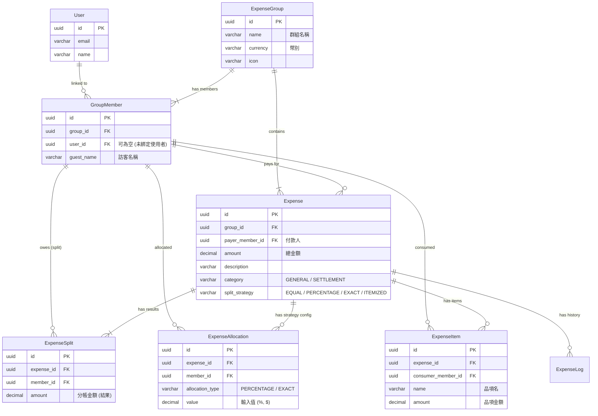

# 資料庫架構文件 (Database Schema)

## Entity Relationship Diagram (ERD)

---

## 資料表詳細定義 (Table Definitions)

### 1. ExpenseGroup (帳務群組)
| 欄位名稱 (Column) | 資料型態 (Type) | 必填 | 說明 (Description) |
| :--- | :--- | :--- | :--- |
| `id` | UUID | Y | 主鍵 (Primary Key) |
| `name` | VARCHAR(255) | Y | 群組名稱 |
| `currency` | VARCHAR(10) | Y | 幣別代碼 (例如：TWD, USD) |
| `icon` | VARCHAR(255) | N | 群組圖示 URL |
| `created_at` | DATETIME | Y | 建立時間 |

### 2. GroupMember (群組成員)
| 欄位名稱 (Column) | 資料型態 (Type) | 必填 | 說明 (Description) |
| :--- | :--- | :--- | :--- |
| `id` | UUID | Y | 主鍵 |
| `group_id` | UUID | Y | 所屬群組 ID (FK -> ExpenseGroup) |
| `user_id` | UUID | N | 連結的系統使用者 ID (若為訪客則為空) |
| `guest_name` | VARCHAR(255) | N | 訪客顯示名稱 (若無 User ID 則顯示此名稱) |
| `avatar_url` | VARCHAR(255) | N | 頭像 URL |

### 3. Expense (帳務/消費)
| 欄位名稱 (Column) | 資料型態 (Type) | 必填 | 說明 (Description) |
| :--- | :--- | :--- | :--- |
| `id` | UUID | Y | 主鍵 |
| `group_id` | UUID | Y | 所屬群組 ID |
| `payer_member_id` | UUID | Y | 先墊付款項的成員 ID (FK -> GroupMember) |
| `amount` | DECIMAL(10,2) | Y | 該筆消費總金額 |
| `description` | VARCHAR(255) | Y | 消費說明 (例如：週五晚餐) |
| `category` | VARCHAR(20) | Y | 類別：`GENERAL`(一般消費) 或 `SETTLEMENT`(結帳/還款) |
| `split_strategy` | VARCHAR(20) | N | 分帳策略：`EQUAL`, `PERCENTAGE`, `EXACT_AMOUNT`, `ITEMIZED` |
| `date` | DATETIME | Y | 消費日期 |
| `is_deleted` | BOOLEAN | Y | 軟刪除標記 (Default: false) |

### 4. ExpenseSplit (分帳算結果)
此表儲存系統 **計算後** 的結果，代表「誰欠了多少錢」。Balance Service 依據此表計算餘額。

| 欄位名稱 (Column) | 資料型態 (Type) | 必填 | 說明 (Description) |
| :--- | :--- | :--- | :--- |
| `id` | UUID | Y | 主鍵 |
| `expense_id` | UUID | Y | 關聯的消費 ID |
| `member_id` | UUID | Y | 需分攤費用的成員 ID |
| `amount` | DECIMAL(10,2) | Y | 該成員應付金額 |

### 5. ExpenseAllocation (分帳策略設定 - 比例/指定)
當策略為 `PERCENTAGE` 或 `EXACT_AMOUNT` 時，儲存使用者的輸入設定。

| 欄位名稱 (Column) | 資料型態 (Type) | 必填 | 說明 (Description) |
| :--- | :--- | :--- | :--- |
| `id` | UUID | Y | 主鍵 |
| `expense_id` | UUID | Y | 關聯的消費 ID |
| `member_id` | UUID | Y | 設定對象成員 ID |
| `allocation_type` | VARCHAR(20) | Y | 類型：`PERCENTAGE` 或 `EXACT_AMOUNT` |
| `value` | DECIMAL(10,2) | Y | 設定值 (百分比數值或指定金額) |

### 6. ExpenseItem (分帳策略設定 - 細項)
當策略為 `ITEMIZED` 時，儲存消費的細項清單。

| 欄位名稱 (Column) | 資料型態 (Type) | 必填 | 說明 (Description) |
| :--- | :--- | :--- | :--- |
| `id` | UUID | Y | 主鍵 |
| `expense_id` | UUID | Y | 關聯的消費 ID |
| `consumer_member_id`| UUID | Y | 該品項的消費者成員 ID |
| `name` | VARCHAR(255) | Y | 品項名稱 (例如：牛肉麵) |
| `amount` | DECIMAL(10,2) | Y | 品項金額 |

### 7. ExpenseLog (操作日誌)
| 欄位名稱 (Column) | 資料型態 (Type) | 必填 | 說明 (Description) |
| :--- | :--- | :--- | :--- |
| `id` | UUID | Y | 主鍵 |
| `expense_id` | UUID | Y | 關聯的消費 ID |
| `action` | VARCHAR(20) | Y | 動作：`CREATE`, `UPDATE`, `DELETE` |
| `changed_by` | UUID | Y | 執行操作的成員 ID |
| `created_at` | DATETIME | Y | 操作時間 |
